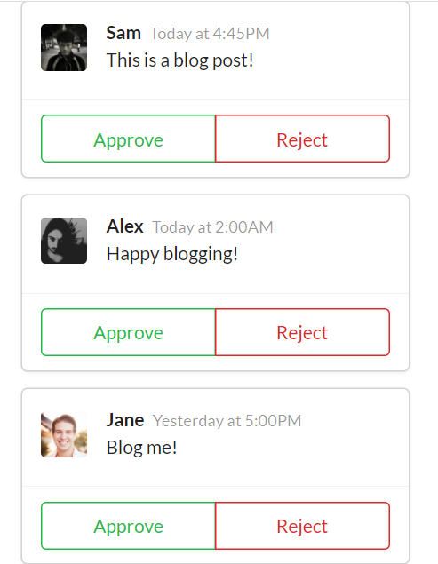

# Simple Blog App in ReactJS

This project was to emphasize some basic points in ReactJS:
* Duplicating Components
* Component Nesting
* Communicating with Props
* Reusing Components

Dependencies used:
* FakerJS - used for fake profile images
* Semantic UI - used for basic styling 

Project 1 in the Modern React with Redux course with Stephen Grider